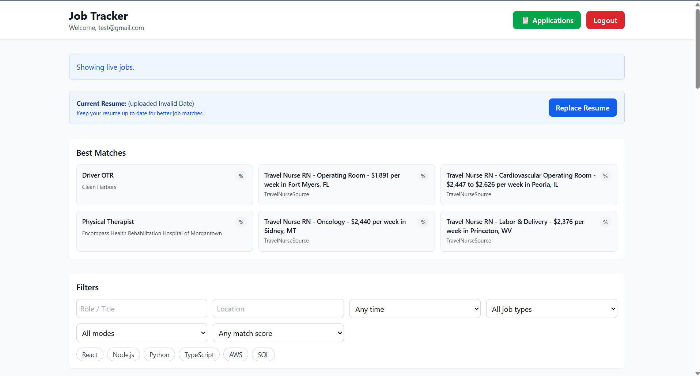

# AI-Powered Job Tracker with Smart Matching

A full-stack AI application that parses resumes, fetches real-time jobs, and ranks them using AI-based matching. The system includes filtering, top matches, and an AI assistant to control job preferences.

---
## Why This Project Matters

Job searching is time-consuming and often involves manually filtering hundreds of listings. This project uses AI-powered semantic matching and workflow automation to help candidates discover relevant opportunities faster and more accurately.

---

---

## 🔥 Key Features

- AI-powered semantic job matching
- Resume parsing using LLMs
- Embedding-based similarity scoring
- Fastify backend APIs
- Real-time job filtering
- Vector search workflows
- Authentication and user workflows

---

## 🏗️ System Architecture

👉 

**Flow:**
Resume → Parsing → Embedding → Job Fetch → Matching → Ranking → UI Display

---

## 🛠️ Tech Stack

**Frontend:**
- React
- JavaScript
- HTML/CSS

**Backend:**
- Fastify (Node.js)
- REST APIs

**AI / ML:**
- OpenAI API
- RAG (Retrieval-Augmented Generation)
- Embeddings

**Data & Processing:**
- JSON storage / In-memory processing
- Job API integration (Adzuna)

**Tools:**
- Windsurf (AI-assisted development)
- GitHub

---

## Backend APIs

- Resume Upload API
- Job Fetch API
- Semantic Matching API
- Recommendation API
- Authentication API

---

## Project Structure

frontend/        → React frontend  
backend/         → Fastify backend APIs  
docs/            → Screenshots & architecture  
data/            → Resume and job data  

---

## 📸 Screenshots

### Home / Job Listings

### Filtering (24 hours / 1 week)

---

## 🧠 How AI is Used

- Resume is uploaded and processed using LLM APIs  
- Extracted data is structured into skills and experience  
- Jobs are fetched from external APIs  
- Matching is performed using:
  - Embeddings similarity  
  - Rule-based scoring  
  - LLM-assisted evaluation  
- Top matches are ranked and displayed to the user  

---

## Challenges Faced

- Handling inconsistent resume formats
- Improving semantic matching accuracy
- Managing API response latency
- Designing scalable workflow pipelines
- Balancing rule-based and embedding-based scoring

---
## 💡 Key Learnings

- Designing AI systems beyond simple API calls  
- Handling large data using chunking and pipelines  
- Improving AI output reliability using validation logic  
- Building end-to-end applications combining AI + backend + UI  

---

## 🚧 Future Improvements

- Add database (PostgreSQL / MongoDB)
- Improve UI/UX for better user experience
- Enhance matching accuracy with advanced ranking models
- Deploy at scale with cloud infrastructure (AWS / Render)

---

## My Contributions

- Built backend APIs using Fastify
- Integrated OpenAI APIs and embeddings
- Developed semantic matching workflows
- Implemented resume parsing pipelines
- Designed filtering and recommendation logic
- Improved debugging and workflow automation

---

## Deployment Architecture

Frontend: Netlify  
Backend APIs: Render  
AI Services: OpenAI API  
External Data: Adzuna API

---

## ⚡ Project Highlights

- Built a working AI system combining LLMs, APIs, and backend pipelines  
- Handles job matching across multiple listings using scoring logic  
- Uses caching and structured processing to improve performance  
- Designed modular architecture for scalability  

---

# Track-My-Jobs-AI
